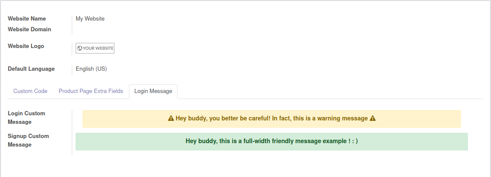
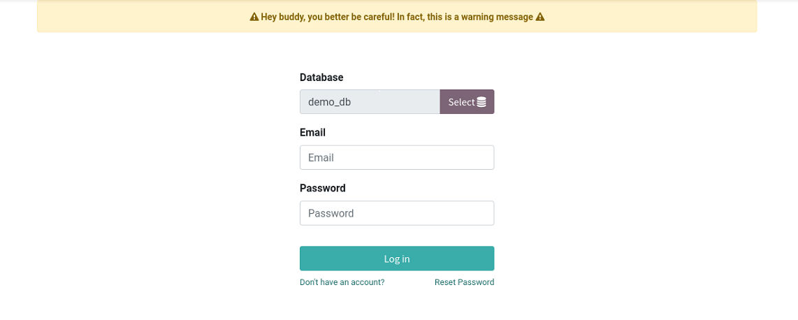
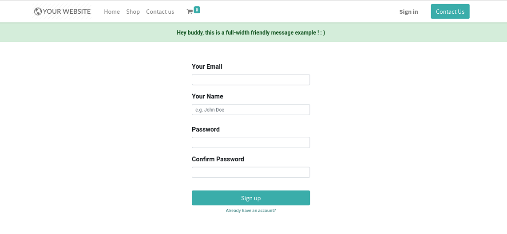

# Login Show Custom Message

## Description

<p style="font-size:15px;">Define a message in website configuration. You can set two different message: one for the login
and a different one for the signup</p>



### Login View



### Signup View



### Message templates (examples):

<p style="font-size:15px;">You can use any type of message, simple text or html. You can use the following html snippets as templates.</p>

```
<div class="container">
<div class="alert alert-warning col" style="text-align: center;"><font style="font-size: 14px;">
<i class="fa fa-warning" title="warning"></i><b> Hey buddy, you better be careful! In fact, this is a warning message&nbsp;</b><i class="fa fa-warning" title="warning"></i></font><br></div><p></p>
</div>
```

```
<div class="alert alert-success" style="text-align: center;"><font style="font-size: 14px;">
<b> Hey buddy, this is a full-width friendly message example ! : )</b></font><br></div><p></p>
```
