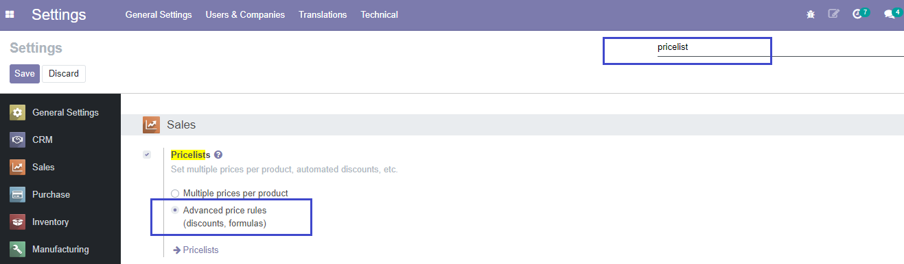
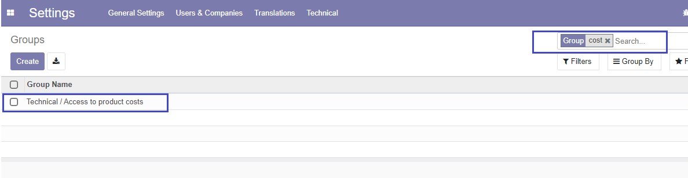
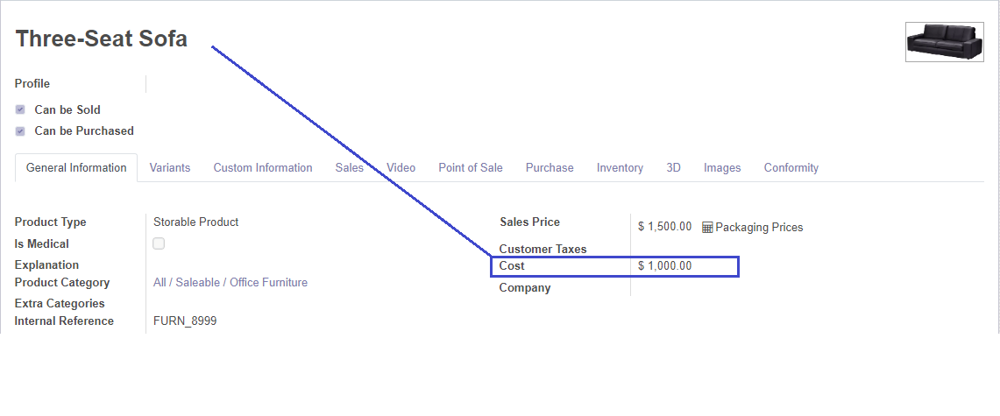
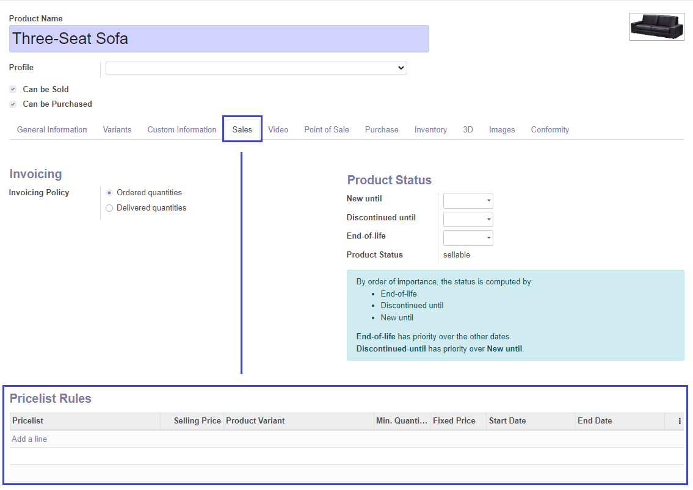
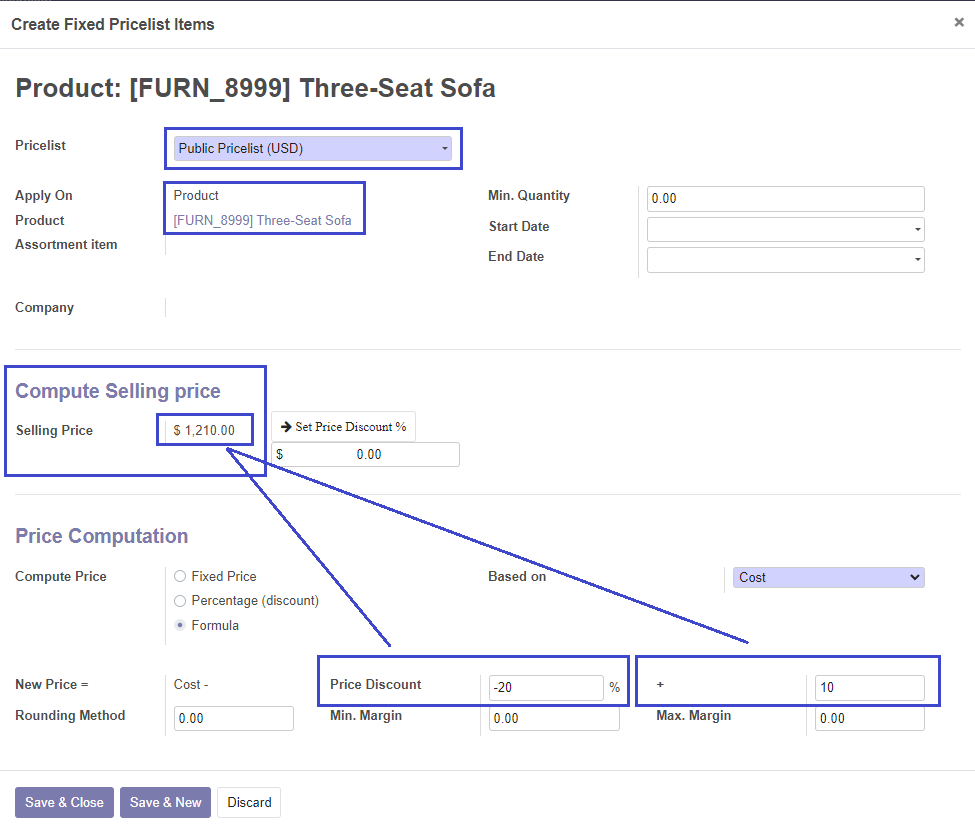
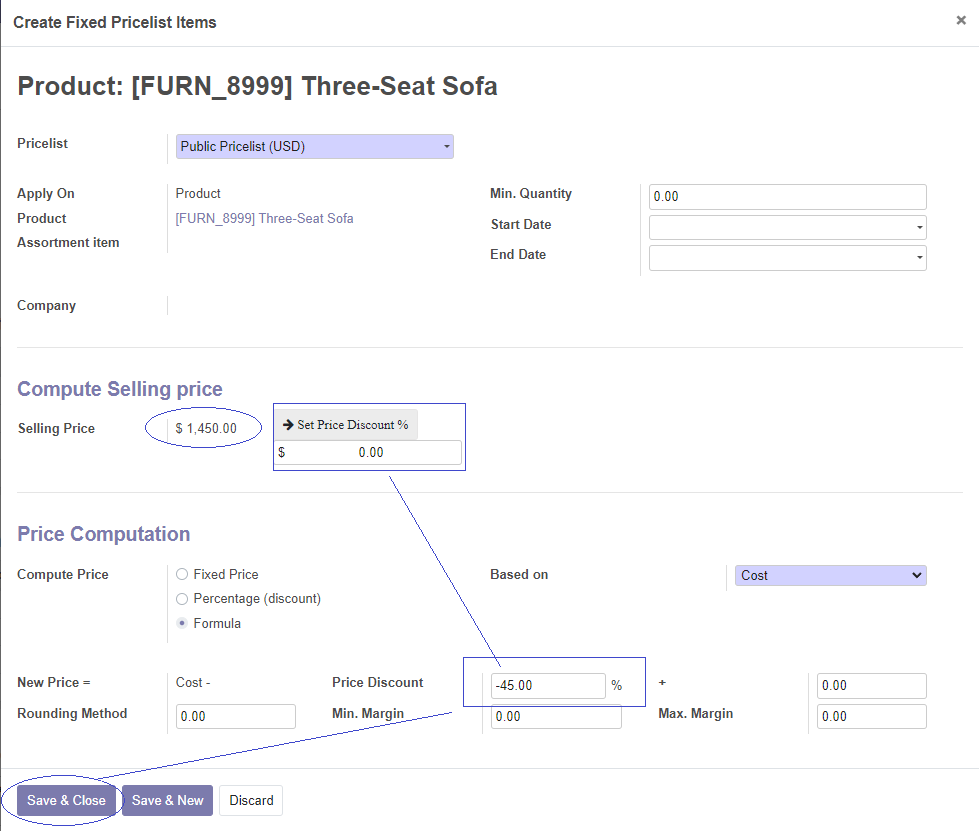

<h1>Module Features</h1>

This module extends <a href="https://github.com/OCA/product-attribute/tree/14.0/product_form_pricelist">product_form_pricelist</a>
module by OCA (make sure you have it installed)

After you install this module, it will unlock full access to product pricelist rule 
form-view accessible by product form-view

A computed field 'Selling Price' has been added to show the price simulation for the active rule

<i>Feature available only for product-based rules</i>

<b>Percent change</b>: if you need to set the percentage discount but you are aware of selling price
instead of
percentage value,
with this module you can directly provide the desired Selling Price in a <b>user-input monetary
field</b>,
then click the button <b>Set Price Discount %</b> and the percentage discount field will be calculated
and
set for you by applying the Percentage Change formula: 
 

    <i>``(User Input - SP) / SP x 100´´</i>

 
where <b>SP is Selling Price recomputed on click</b> depending on the chosen <b>'Based On'</b>
parameter (product sales price, cost, other pricelist...)

<i>Feature available only for product-based rules</i>

<i>The button is not visible on pseudo-records. Save record to access this feature if you create a new rule</i>

<h3><i>These features are only available for pricelist-rules applied at product level </i></h3>

**************

<h3>Usage</h3>

Be sure that you enabled <b>Advanced Pricelist Rules</b> in <b>Settings Menu</b>

<b>Choose a product</b>, we will use a pricelist rule based on product <b>Cost</b>

You might need to add User Admin to 'Access to product costs' group to see product cost

In the product form-view check for <b>Sales Page</b> and scroll down to the <b>Pricelist Rules</b> table,
this is a shortcut to define pricelist-rules at product level from the product form-view.
 

By clicking on 'Add Line'
you will be able to configure a pricelist rule for this product.

In the new <b>Computed Selling Price</b> section, Selling price is recomputing
every time a parameter is changed showing a price simulation for active product.

<i>Note that you will have to manually define the product-pricelist relationship, but the 'apply on
level' and
'product id' parameters are already defined on the rule.</i>
 

<b>We want to sell product (which costs $1000) at $1450.
</b>

Provide the final selling price.

You can see <b>Price Discount</b> will be properly set at -45%, and the <b>Computed Selling Price</b>
shows the new Selling Price accordingly to pricelist-rule parameters.

Save and close record to register the new <b>Price Discount</b>.

<i>The user input get restored at $0.00 when operation is complete.
</i>
 

**************

<h3>Other info</h3>

 
* <b>Product Variants:</b> not fully supported
* <b>Module dependencies:</b> 
  * <a href="https://github.com/OCA/product-attribute/tree/14.0/product_form_pricelist">product_form_pricelist</a>
  * <a href="https://github.com/OCA/server-tools/tree/14.0/base_view_inheritance_extension">base_view_inheritance_extension</a>

