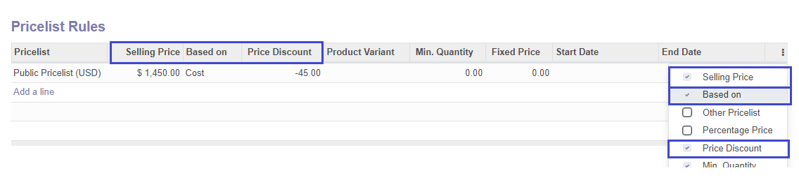
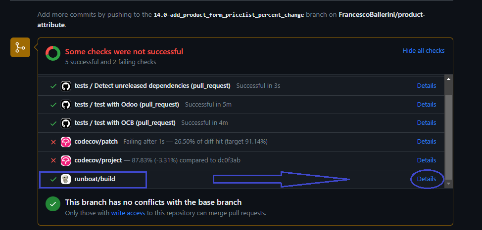
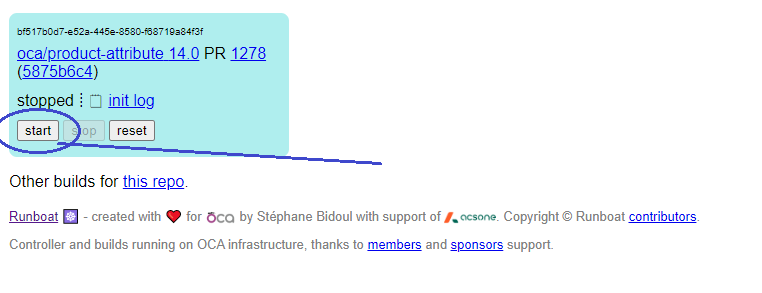
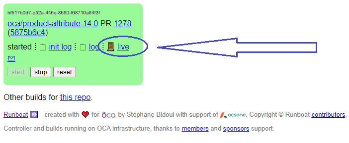

<h1>Module Features</h1>
<ul style="font-size: 1.2em;">
            <li>
                Full access to product pricelist rule form-view by product form-view
            </li>
             
            <li>
                A computed field 'Selling Price' shows the selling price for active product template or variant
                depending on provided parameters set on the product pricelist-rule
            </li>
             
            <li>
                <b>Percent change</b>: if you need to set the percentage discount but you are aware of selling price
                instead of
                percentage value,
                with this module you can directly provide the desired Selling Price in a <b>user-input monetary
                field</b>,
                then click the button <b>Set Price Discount %</b> and the percentage discount field will be calculated
                and
                set for you by applying the Percentage Change formula: 
                 
                

                    <i>``(User Input - SP) / SP x 100´´</i>
                

                 
                where <b>SP is Selling Price recomputed on click</b> depending on the chosen <b>'Based On'</b>
                parameter (product sales price, cost, other pricelist...)
            </li>
</ul>

**************

<h3>Simple Use Case...</h3>

Be sure that you enabled <b>Advanced Pricelist Rules</b> in <b>Settings Menu</b>

<b>Choose a product</b>, we will use a pricelist rule based on product <b>Cost</b>

You might need to add User Admin to 'Access to product costs' group to see product cost

In the product form-view check for <b>Sales Page</b> and scroll down to the <b>Pricelist Rules</b> table,
this is a shortcut to define pricelist-rules at product level from the product form-view.
 

By clicking on 'Add Line'
you will be able to configure a pricelist rule for this product.

In the new <b>Computed Selling Price</b> section, Selling price is recomputing
every time a parameter is changed showing a price simulation for active product.

<i>Note that you will have to manually define the product-pricelist relationship, but the 'apply on
level' and
'product id' parameters are already defined on the rule.</i>
 

<b>We want to sell product (which costs $1000) at $1450.
</b>

Provide the final selling price.

You can see <b>Price Discount</b> will be properly set at -45%, and the <b>Computed Selling Price</b>
shows the new Selling Price accordingly to pricelist-rule parameters.

Save and close record to register the new <b>Price Discount</b>.

<i>The user input get restored at $0.00 when operation is complete.
</i>
 

Some <b>improvements</b> are made on the pricelist rules <b>tree-view</b>, now it is possible to show
columns
for <b>rule parameters</b> like <b>Based On</b>, <b>Price Discount</b>, <b>Computed Selling Price</b>
(only for rules applied
at product level) and so on.

**************

<h3>Other info</h3>

<ul>
    <li>
        This module extends <a href="https://github.com/OCA/product-attribute/tree/14.0/product_form_pricelist"
                               target="_blank">Product
        Form Pricelist</a> from <a href="https://github.com/OCA/product-attribute/tree/14.0" target="_blank">
        OCA Product Attribute repository</a> (you will need it in your Odoo instance to be able to install this
        module).
    </li>
     
    <li>
        <b>Product Variants:</b> product variant workflow has been taken into consideration in the developement
        process
        when it was possible so this module should provide a decent base for compatibility with product variant
        workflow.
        Despite that, depending on what you need to do it might require some extra implementation to be
        effective.
    </li>
     
    <li>
        All the listed features supports pricelist based on <b>Other Pricelist</b>.
    </li>
</ul>

************

<h3>Module Istance</h3>

The module is available at OCA runbot from this <a href="https://github.com/OCA/product-attribute/pull/1278">Pull
Request</a>

Navigate to the bottom of the page and click on <b>Details</b>

Check the build state: press <b>Start</b> and wait for <b>Started</b> status of the instance

Click on <b>Live</b> when it's ready. Use 'admin' as username and password.
You can click on <b>reset</b> to reboot and have a clean instance

